# Descrição do Projeto Força Bruta com Medusa

Laboratório prático utilizando Kali Linux e a ferramenta Medusa, em conjunto com ambientes vulneráveis Metasploitable 2 e DVWA, para simular cenários de ataque de força bruta. 
Configurar o ambiente: duas VMs (Kali Linux e Metasploitable 2 no VirtualBox, com rede interna (host-only). 
Executar ataques simulados: força bruta em FTP, automação de tentativas em formulário web (DVWA) e password spraying em SMB com enumeração de usuários.
Bloquear ataque de força bruda no serviço  SSH da ferramenta Hydra com o Fail2ban.


## Configuração do Ambiente

Primeiro vamos configurar nosso ambiente para realizar os testes de força bruta.
Faça o download do sistema operacional Kali Linux disponível no site https://www.kali.org/.
Clique em download, Virtual Machines e VirtualBox. 

Baixe a maquina vulnerável do Metasploitable2 disponível no site  https://sourceforge.net/projects/metasploitable/.  

## Instalação das Maquinas

Vamos utilizar o virtualizador Oracle VirtualBox para instalar o Kali Linux e o Metasploitable2.
É necessário extrair os dois arquivos baixados antes de fazer a instalação no VirtualBox.
Abra o VirtualBox e clique em Novo escolha um nome para VM Name, selecione o OS Linux e em OS Distribution selecione Ubuntu. Na próxima janela selecione a quantidade de memória RAM a quantidade de núcleos do processador e a quantidade de memória do SSD que a maquina Kali Linux vai utilizar. O Kali Linux precisa de no mínimo 2048 MB de memória RAM e 20GB de espaço para o sistema operacional. Selecione pelo menos dois núcleos do processador. 

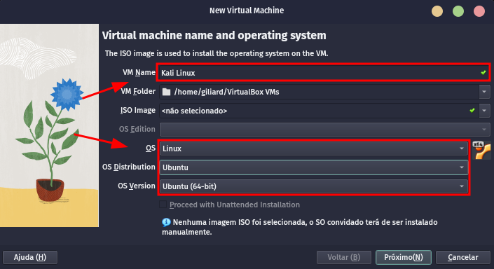
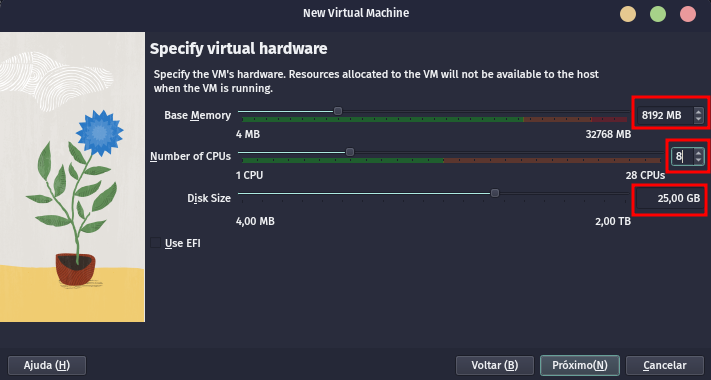

Clique em configurações para definir as configurações antes de iniciar a maquina virtual Kali Linux. Selecione Armazenamento, controladora IDE e clique no ícone para adicionar o hard disk.
No seletor de Mídias clique em acrescentar e selecione o arquivo baixado no formato .vdi.

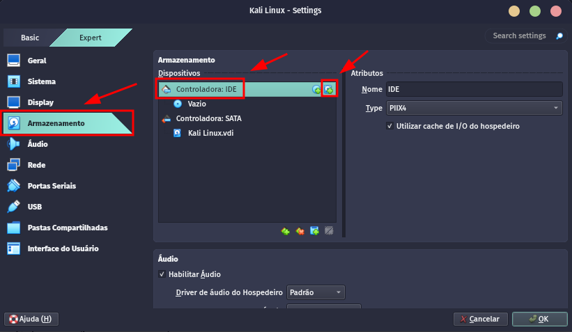
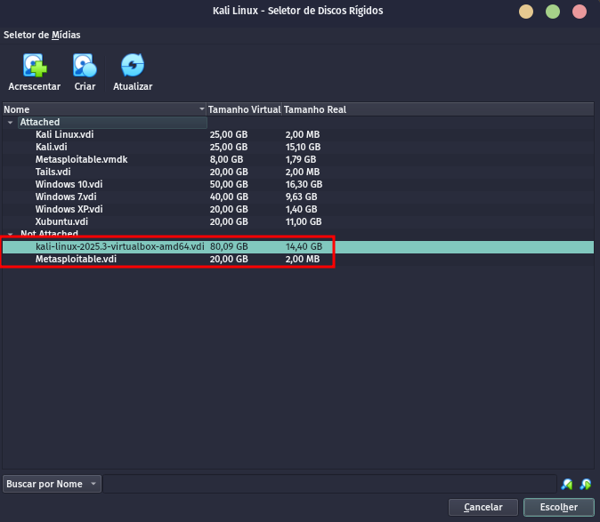

Antes de iniciar a maquina vamos também configurar a rede clicando em Configurações.
Na janela de configurações clique em Rede e na opção “Ligado a” selecione Placa de rede exclusiva de hospedeiro (host only) clique e OK.

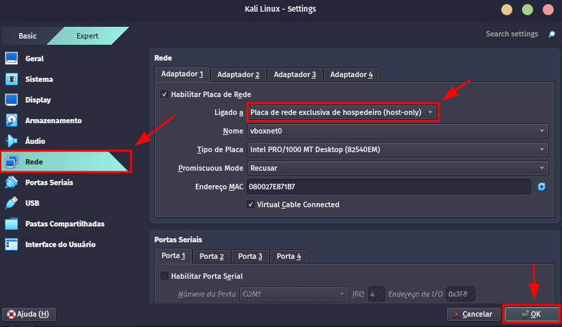


Hora de configurar nossa maquina Metasploitable2. Clique em Novo escolha um nome para VM Name, selecione o OS Linux e em OS Distribution selecione Ubuntu. Selecione a quantidade de memória RAM a quantidade de núcleos do processador e a quantidade de memória do SSD que a maquina Metasploitable2 vai utilizar. Eu selecionei 2048 MB de memória RAM e dois núcleos do processador. Faça as mesmas configurações de rede e na configuração de armazenamento escolha a imagem baixada no formato .mdk do Metasploitable2.


Inicie a maquina Metasploitable2. Após a maquina iniciar vamos fazer login com o usuário `msfadmin` e a senha `msfadmin`. 

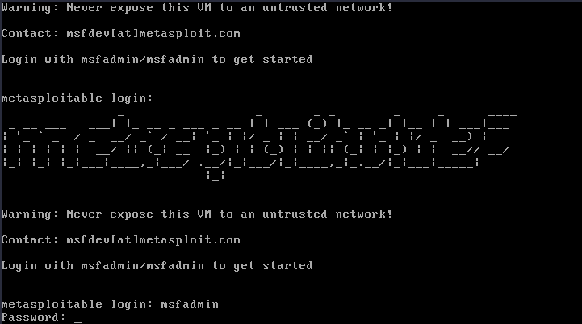


Para saber qual o endereço IP da maquina Metasploitable2 digite `ifconfig` para visualizar o endereço IP. 

```bash
ifconfig

```


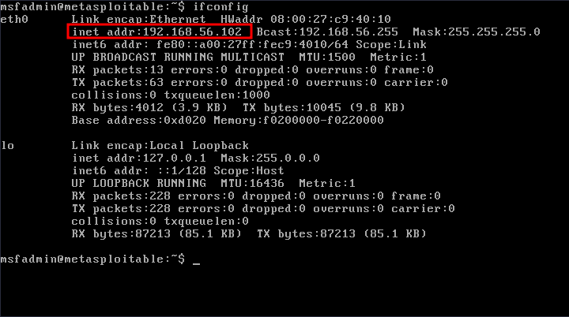


Inicie a maquina Kali Linux. Após a maquina iniciar vamos fazer login usando o usuário `kali` e a senha `kali`. Abra o terminal do Kali Linux para testar se uma maquina consegue se comunicar com a outra. Digite no terminal ping e o Ip da maquina virtual do Metasploitable2 e aperte Ctrt + C para cancelar o comando. 


```bash
ping 192.168.56.102

```


O ping funcionou a maquina Kali linux consegue comunicar com a maquina virtual do  Metasploitable2.  


### Ataque de Força Bruta no Serviço FTP


Vamos verificar com o nmap se o serviço FTP está habilitado usando o comando `nmap -sV 192.168.56.102`. 

```bash
nmap -sV 21 192.168.56.102

```

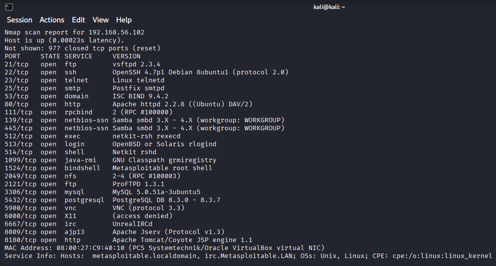

Vamos atacar o FTP porta 21,  HTTP porta 80 DVWA e o SMB porta 139/445.
O serviço FTP está habilitado e com a porta 21 aberta. Para conectar com o FTP digite no terminal `ftp  192.168.56.102`. 


```bash
ftp  192.168.56.102

```

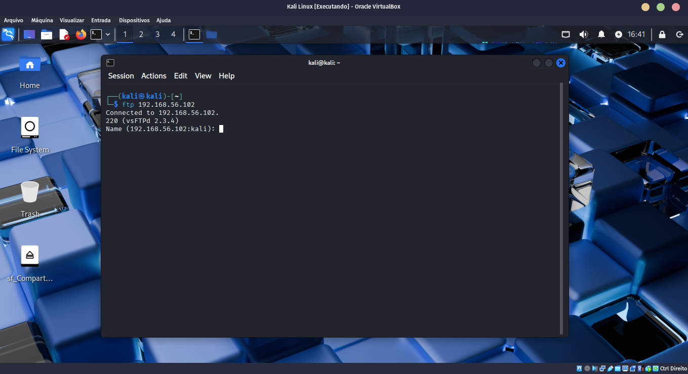


Conseguimos conectar com o FTP, porém não temos usuário e senha para autenticar.
Vamos utilizar força bruta com a Medusa para tentar descobrir o usuário e senha. 
Testes de força bruta podem ser realizado contra vários hosts, usuários ou senhas concomitantemente. A Medusa precisa de dois arquivos o primeiro com os nomes de usuário e o segundo com as senhas que a ferramenta vai usar para tentar autenticar no FTP.


Para criar o primeiro arquivo de texto com os usuários execute o comando no terminal 
`printf "user\nmsfadmin\nnadmin\nnroot" > user.txt”` em seguida execute `printf "123456\nnpassword\nqwerty\nmsfadmin" > pass.txt` para criar o segundo aquivo de texto com as senhas.


```bash
printf "user\nmsfadmin\nnadmin\nnroot" > user.txt

```

```bash
printf "123456\nnpassword\nqwerty\nmsfadmin" > pass.txt

```
Para rodar o ataque utilize o comando `medusa -h 192.168.56.102 -U user.txt -P pass.txt -M ftp -T 6`.

```bash
medusa -h 192.168.56.102 -U user.txt -P pass.txt -M ftp -T 6

```
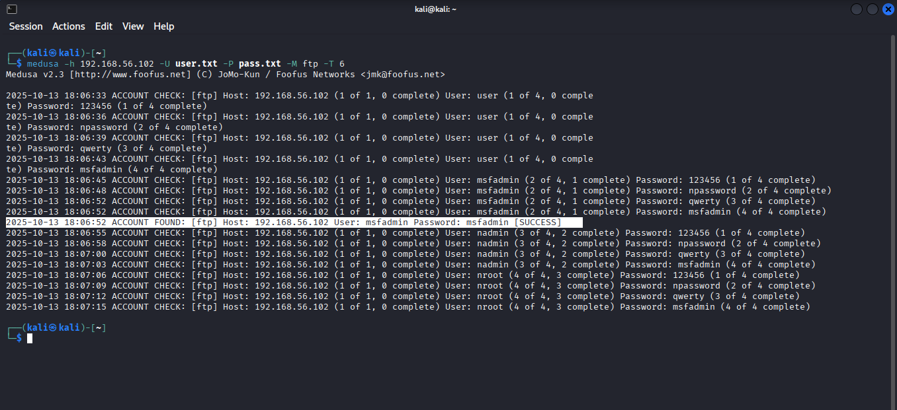


A medusa encontrou uma combinação de usuário e senha validos `User: msfadmin Password: msfadmin`. Vamos validar o usuário e senha tentando acessar o FTP pelo terminal usando o comando `ftp 192.168.56.102`. Digite `msfadmin` para Name e `msfadmin` para Password.

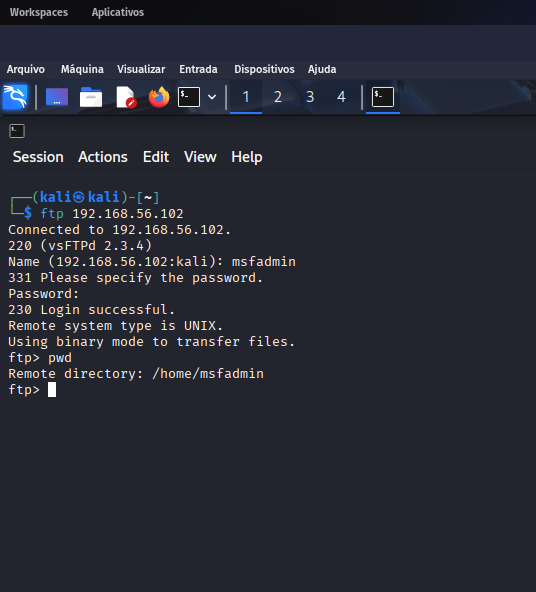


Agora vamos usar a Medusa para fazer força bruta em uma aplicação Web. Abra o navegador FireFox e digite na barra de pesquisa o endereço `192.168.56.102/dvwa/login.php`.

Para analisar como os dados são enviados para o servidor abra a barra de desenvolvedor usando a tecla F12. Preencha os campos de Username e Password e clique em login.

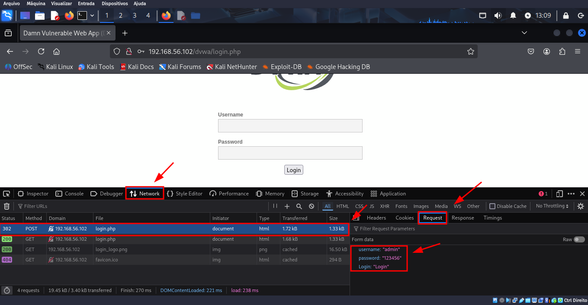

Podemos visualizar na aba Network a requisição do tipo Post e em Request os parâmetros enviados para o servidor. 

Antes de explorar a vulnerabilidade com a medusa vamos criar mais duas wordlists.
Digite o comando no terminal `printf "user\nmsfadmin\nadmin\nroot" > userII.txt` em seguida execute `printf "123456\npassword\nqwerty\nmsfadmin" > passII.txt` para criar o segundo aquivo de texto com as senhas.


```bash
printf "user\nmsfadmin\nadmin\nroot" > userII.txt

```

```bash
printf "123456\npassword\nqwerty\nmsfadmin" > passII.txt

```
Vamos utilizar novamente o a medusa para fazer o ataque de força bruta.

No terminal digite o comando abaixo:

```bash
medusa -h 192.168.56.102 -U userII.txt -P passII.txt -M http \
-m PAGE:'/dvwa/login.php' \
-m FROM:'username=^USER^&password=^PASS^&Login=Login' \
-m 'FAIL=Login failed' -t 6

```


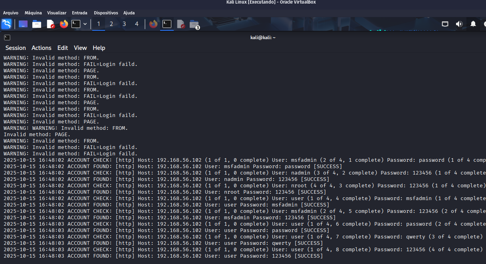


Para validar o login acesse o endereço 192.168.56.102/dvwa/login.php usando as credenciais Username: `admin` e Password: `password`.

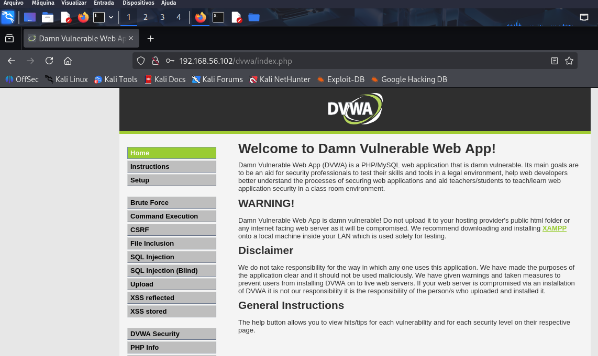


## Ataque de Força Bruta no SMB

Vamos fazer testes no protocolo de comunicação SMB usado para compartilhar o acesso a pastas, arquivos, impressoras e outros recursos em uma rede local ou remota. Ele se integra a sistemas operacionais Windows, macOS e Linux, otimizando a eficiência no compartilhamento de dados.


Hora de utilizar o `enum4linux` para extrair informações sobre usuários. Execute no terminal o camando `enum4linux -a 192.168.56.102 | tee enum4_output.txt`.


```bash
enum4linux -a 192.168.56.102 | tee enum4_output.txt

```

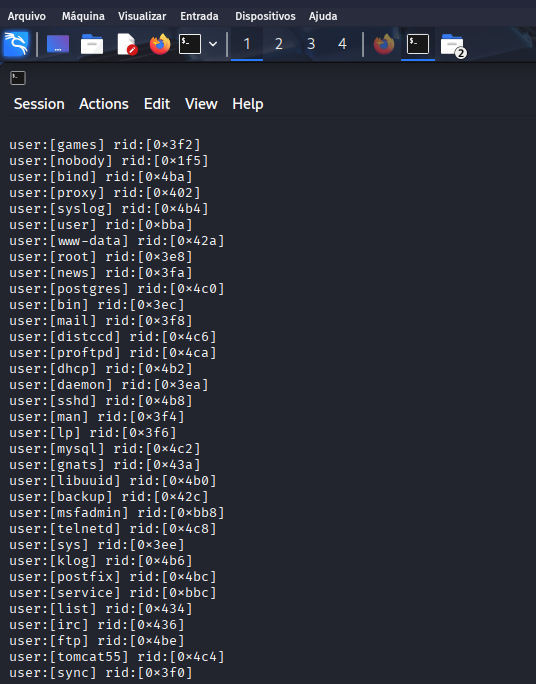

Crie duas wordlists para usuário e senha com os comandos.


```bash
printf "user\nmsfadmin\nsevice" > smb_users.txt

```

```bash
printf "password\n123456\nWelcome123\nmsfadmin" > senhas_spray.txt

```

Para fazer o ataque de força bruta com a medusa digite no terminal o comando
`medusa -h 192.168.56.102 -U smb_users.txt -P senhas_spray.txt -M smbnt - 2 T 50`.

```bash
medusa -h 192.168.56.102 -U smb_users.txt -P senhas_spray.txt -M smbnt - 2 T 50

```


Para validar o acesso use no terminal o comando `smbclient -L //192.168.56.102 -U msfadmin`
e digite a senha msfadmin.

```bash
smbclient -L //192.168.56.102 -U msfadmin

```


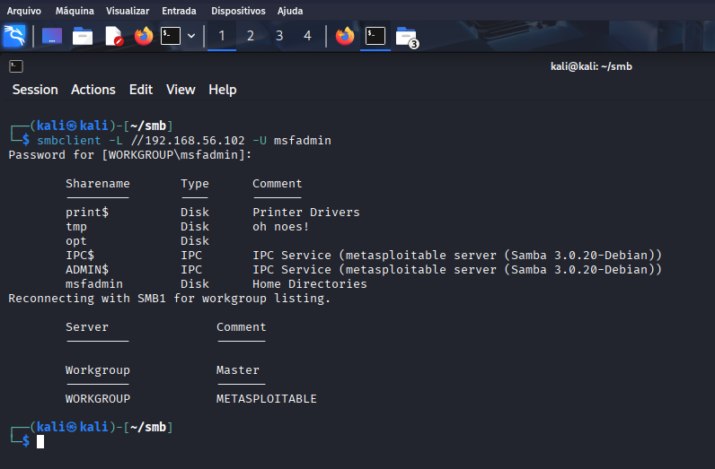


## Formas de Mitigar Ataques de Força Bruta

Limitar as tentativas de login com bloqueio ou atraso de login após um número definido de falhas por exemplo 5 tentativas.
Usar CAPTCHA ou reCAPTCHA para formulário web para exigir a verificação humana após várias tentativas mal-sucedidas. 
Exija senhas fortes de no mínimo 12 caracteres, caracteres especiais, números, letras maiúsculas e minúsculas.
Expiração e renovação periódica de senhas quando apropriado.
Autenticação de dois fatores 2FA  por SMS, app autenticador Google Authenticator, Authy  ou token físico.
Utilize o FTPS  ou  SFTP. O FTPS  é a versão segura do protocolo FTP tradicional. Ele adiciona criptografia TLS/SSL, semelhante à usada em HTTPS. O SFTP não tem relação técnica com FTP. Ele é um protocolo próprio que funciona por cima do SSH Secure Shell que também pode ser utilizado para transferência de arquivos.
Restringir acesso com base em endereços IP é um método prático para reduzir o risco de ataques de força bruta com a implementação de lista branca de IPs com acesso permitido. Lista negra de IPs com acesso não autorizados para mitigar tentativas de ataque.
Utilize ferramentas de análise comportamental e sistemas de detecção de intrusões (IDS/IPS) para identificar padrões de tentativas de login incomuns. Alertas em tempo real ajudam a responder rapidamente a possíveis ataques de força bruta.

## Mitigando Ataques de Força Bruta com fail2ban 


Vamos utilizar a ferramenta chamada fail2ban para bloquear muitas tentativas de login no serviço SSH usado para acesso remoto. O fail2ban é um IPS (Intrusion Prevention System, sistema de prevenção de intrusos) na forma de um daemon que monitora as tentativas de acesso aos serviços do sistema e age proativamente quando detecta um endereço IP que aparenta comportamento suspeito.

Para realizar os testes vamos instalar o sistema operacional Ubuntu Server disponível no site https://ubuntu.com/download/server. Faça o download da ISO para fazer a instalação no VirtualBox.
Clique em novo no VirtualBox faças as configurações iniciais e na configuração de rede deixe em modo NAT. Vai ser preciso fazer o download da ferramenta fail2Ban se o Ubuntu Server for configurado como Host Only não será possível fazer o download da ferramenta fail2ban.


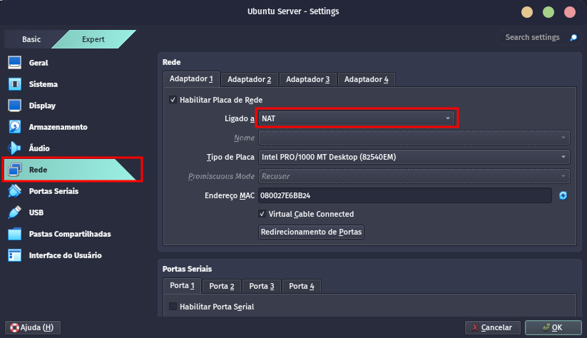


Faça a instalação do Ubuntu Server selecionado a opção Ubuntu Server (minimized).


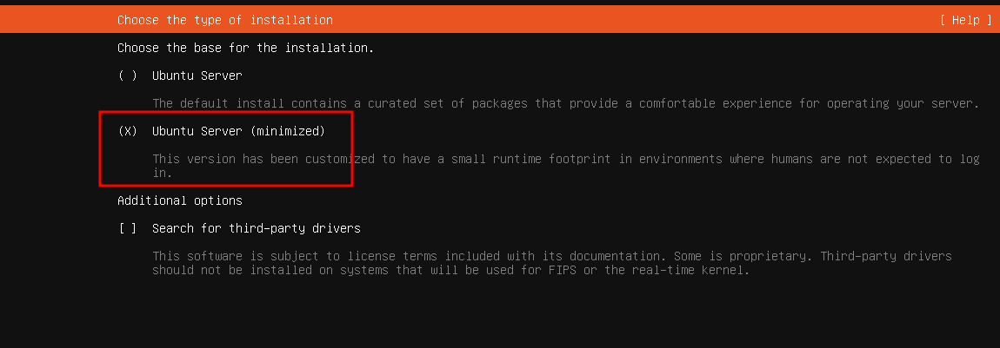


Marque a opção Install OpenSSH Server.


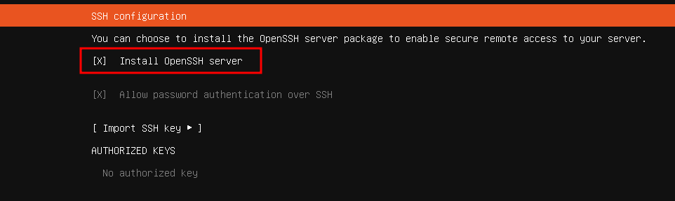


Reinicie o Ubuntu Server faça login com o usuário e senha configurado na instalação.
Vamos atualizar a lista de repositórios e fazer a atualização do sistema antes de instalar o fail2ban. Digite no terminal `sudo apt update` para atualizar a lista de repositórios.

```bash
sudo apt update

```

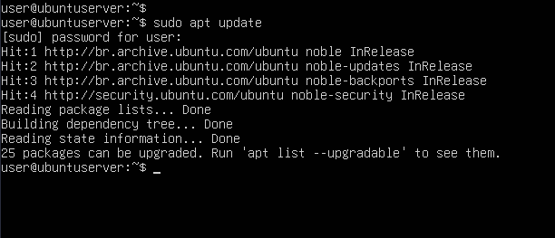


Para atualizar os pacotes digite `sudo apt upgrade` na linha de comando.

```bash
sudo apt upgrade

```


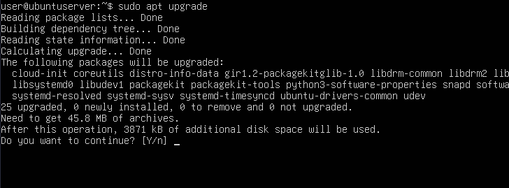


Instale o editor de texto nano com o comando `sudo apt install nano`.
Instale o iptables com o comando `sudo apt install iptables`.

Hora de instalar a ferramenta fail2ban. Digite no terminal o comando `sudo apt install fail2ban` e digite enter.


```bash
sudo apt install fail2ban

```

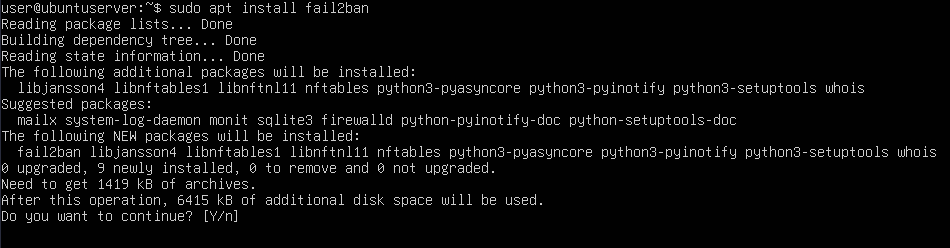


Quando finalizar a instalação do Fail2ban desligue a maquina e modifique a configuração de rede da maquina Ubuntu Server para host only no VirtualBox.


Inicie a maquina Ubuntu Server e digite na linha de comando `systemctl status ssh` para ver se o serviço do ssh está ativo.


```bash
systemctl status ssh

```
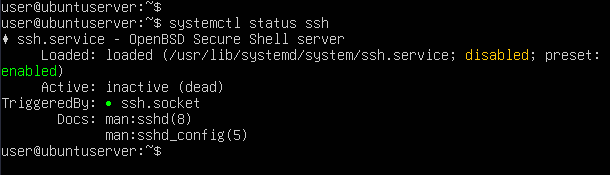

 

Vamos verificar nosso endereço ip com o comando `ip addr`.


```bash
ip addr

```

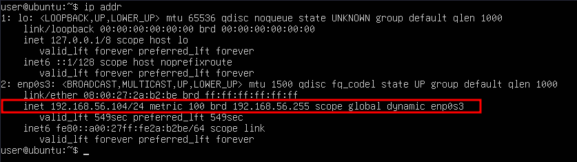

Crie o diretório fail2ban no caminho /var/run/fail2ban e configure as permissões necessárias com os comandos abaixo.


```bash
sudo mkdir -p /var/run/fail2ban
sudo chmod 755 /var/run/fail2ban
sudo chown root:root /var/run/fail2ban

```


Para acessar os aquivos de configuração da ferramenta fail2ban acesse o diretório fail2ban localizado no caminho /etc/fail2ban. Digite no terminal `cd /etc/fail2ban` e digite `ls -l` para listar os arquivos.


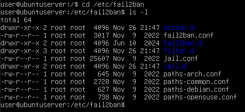


Faça uma copia do arquivo jail.conf com o nome jail.local com o comando `cp jail.conf jail.local`.


 

Não é recomendável modificar o arquivo jail.conf, pois ele pode ser substituído quando o pacote é atualizado. Ele contém a declaração e configuração das jaulas (jails), que correspondem aos serviços monitorados pelo fail2ban. Você deve habilitar as que precisa e adaptar suas configurações à realidade do seu servidor.

Vamos editar as configurações do arquivo jail.local usando o nano. Digite no terminal `nano jail.local`.
Localize as opções abaixo na seção [DEFAULT]:


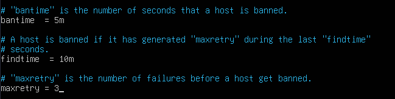


A opção `findtime` define durante quanto tempo as tentativas de acesso são contabilizadas.
A opção `bantime` define durante quanto tempo ficará bloqueado o host que excedeu a quantidade limite de tentativas de acesso.
A opção `maxretry` define quantas tentativas de acesso podem ser feitas antes que ocorra o bloqueio.

O atacante ficará bloqueado por 5 minutos se ele errar a senha 3 vezes dentro de um período de 
10 minutos.


Localize as opções abaixo na seção [sshd]:

Deixe as configurações como na imagem abaixo.

```bash
enabled = true
port = ssh
logpath = /var/log/auth.log
backend = systemd
allowipv6 = auto

```

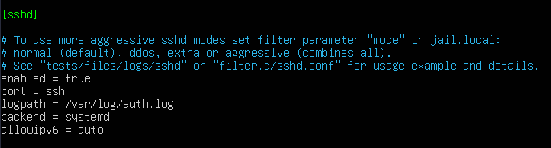


A opção port define a porta na qual o serviço escuta. Se o serviço escuta na porta padrão (no caso do SSH, a porta 22), deixe o valor padrão, que é o nome do serviço (ssh). Se o serviço escuta em uma porta diferente da padrão, substitua o ssh pelo número da porta configurada diferente da configuração padrão.


Para iniciar o fail2ban após a configuração inicial. Execute o comando no terminal
`systemctl start fail2ban` e `systemctl status fail2ban`.


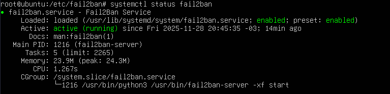

Vamos ver como está as regras no iptables com o comando `sudo iptables -L`.


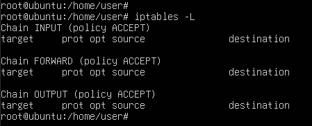


Não existe nenhuma regra definida.


Hora de testar a comunicação da maquina Kali Linux com a maquina Ubuntu Server.
No terminal da maquina Kali linux digite ping e o ip da maquina Ubuntu Server.
No meu caso o comando é `ping -c 3 192.168.56.104`.


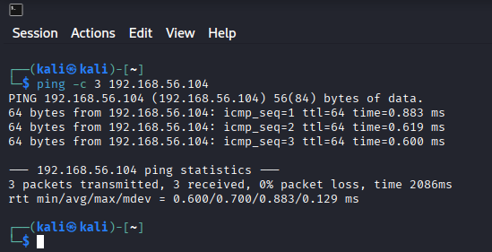


A conexão funcionou a maquina Kali Linux consegue se comunicar com o Ubuntu Server.

Digite no terminal do Kali Linux o comando `nmap -sV 192.168.56.104` para ver os serviços que estão rodando na maquina Ubuntu Server.


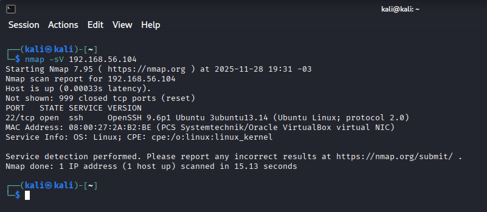


Temos o serviço do Open SSH rodando na porta 22.

Utilize o comando `ifconfig` para ver qual é o endereço ip da maquina Kali Linux.


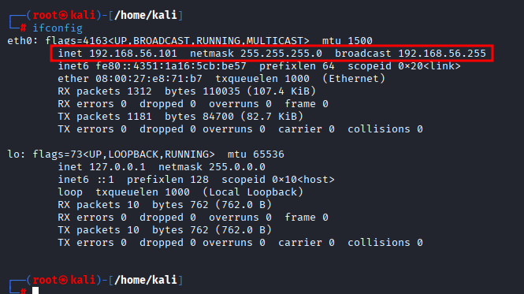
 

Crie duas wordlists com os comandos abaixo no terminal do Kali Linux.


```bash
printf "root\nadmin\nadmiadminn\nteste\nbill\nsteve\nuser" > users_ssh.txt

printf "qwerty\nadmin\nadmiadminn\nteste123\nsenha\nsenha123\n123456" > senhas_ssh.txt

```
Hora de utilizar a Hydra para fazer o ataque de força bruta no serviço ssh.
Se o fail2ban estiver funcionado corretamente ele vai bloquear o ataque após algumas tentativas de login.

Para executar o ataque de força bruta com a Hydra digite no terminal o comando:

```bash

hydra -L users_ssh.txt -p senhas_ssh.txt 192.168.56.104 ssh

```

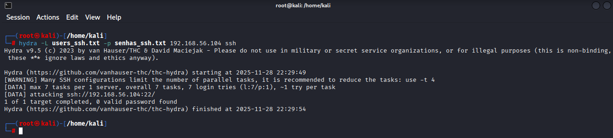


Foi definido para o Ubuntu Server o nome de usuário `user` e a senha `123456`. Não foi possível fazer login porque o ataque foi bloquedo antes de chegar no usuário e senha correto.

No Ubuntu Server foi possível ver com o camando `tail -f /var/log/dail2ban.log` o endereço ip que foi bloqueado.

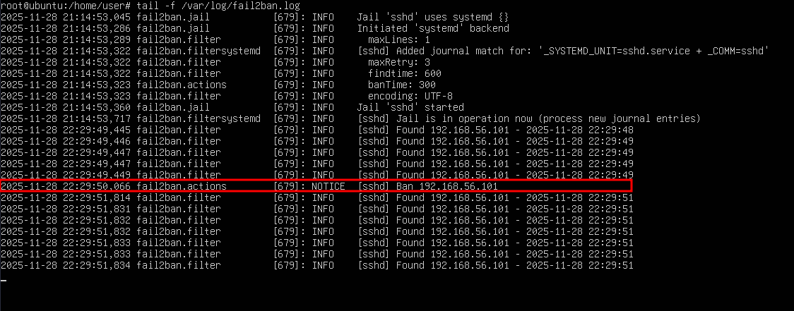

Também podemos ver com o comando `fail2ban-client status sshd` o ip banido.

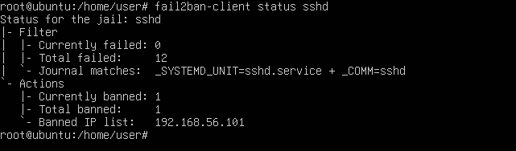


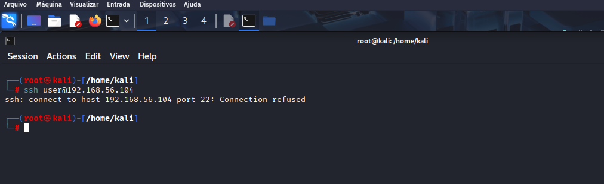

Podemos visualizar no iptables a regra criada para bloquear a maquina Kali Linux. 


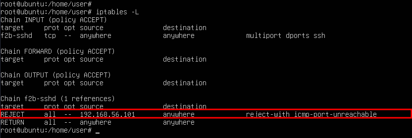

Definimos 5 minutos para o tempo de bloqueio após 3 tentativas dentro do período de 10 minutos. Após 5 minutos foi possível acessar a maquina Ubuntu Server pelo Kali Linux.

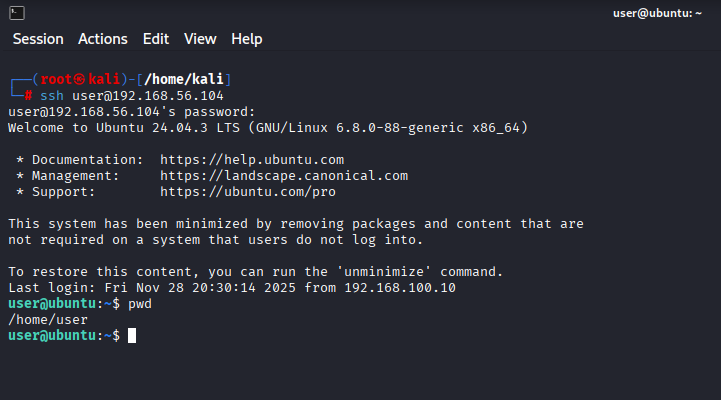


## Recursos

- [Kali Linux](https://www.kali.org/)
- [Medusa Docs](http://foofus.net/goons/jmk/medusa/medusa.html)
- [DVWA GitHub](https://github.com/digininja/DVWA)
- [fail2ban Wiki](https://github.com/fail2ban/fail2ban/wiki)


